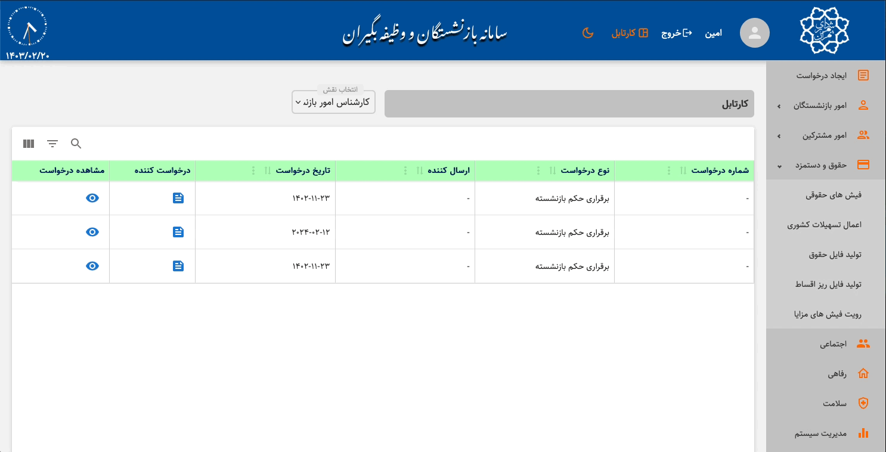
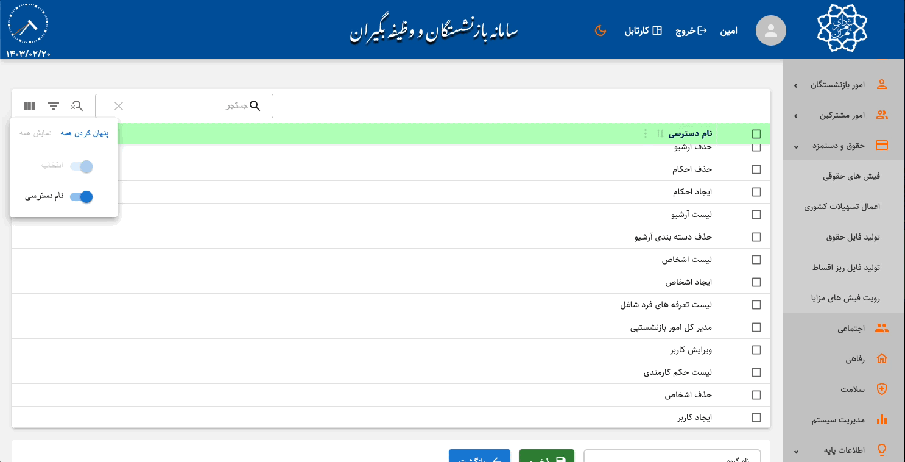

# Retirement Organization System

## Table of Contents

- [Retirement Organization System](#retirement-organization-system)
  - [Table of Contents](#table-of-contents)
  - [Introduction](#introduction)
  - [Project Structure](#project-structure)
  - [Getting Started](#getting-started)
  - [Main Dependencies](#main-dependencies)
  - [Highlighted Fetures](#highlighted-fetures)
  - [Additional Notes](#additional-notes)
  - [License](#license)
  - [Contact](#contact)

## Introduction

This project represents the main system for the Retirement Organization of Municipality of Tehran, managed by [DAHAK](https://github.com/dahakco) company and affiliated with the Municipality of Tehran. This is a large web application which manages the retirement process of an official employee whith all of the details like statements, relateds, family etc. This project also includes a backend infrastructure which written in .NET Core and uses MS SQL Server for data management services. The backend includes lots of REST-APIs to manage every single requests in the application.

## Project Structure

The project is organized into several files and directories:

- **`src/main.jsx`**: The main entry point for the application. It initializes the `AuthProvider` for managing authentication and includes all the routes that application is currently using.

- **`src/App.jsx`**: The App component renders the outlet which servers all the nested routes. The `ToastContainer` is used for displaying notifications.The `ThemeProvider` is also used to provide nice and smooth MUI theme.
- **`src/store.js`**: Manages all the stores used inside the application using [Redux](https://github.com/reduxjs/redux)

- **`src/pages/Login.jsx`**: Represents the login page where users can authenticate themselves.

- **`src/pages/Dashboard.jsx`**: Placeholder for the dashboard page.

- **`src/pages/Error.jsx`**: Placeholder for an error page when the route is not found.

- **`src/assets/styles/main.scss`**: SASS stylesheet for the project.

## Getting Started

1. Clone the repository:
   ```bash
   git clone https://github.com/dahakco/login-screen.git
   ```
2. Install dependencies:
   ```bash
   npm install
   ```
3. Start the development server:
   ```bash
   npm run dev
   ```

**❗️ NOTE**: This is currently not possible to login as far as a valid username and password is requires. Additionally, there is no functionality for creating a new user, as the Municipality automatically generates user accounts based on employment status. To compensate, I have included images, and gifs thorough explanations to accurately showcase the project.

## Main Dependencies

These are the main project dependencies:

- **`react`**: JavaScript library for building user interfaces.
- **`react-router-dom`**: Routing library for React applications.
- **`react-toastify`**: Notification library for displaying alerts and messages.
- **`react-redux`**: Redux bindings for React.
- **`@reduxjs/toolkit`**: Redux toolkit for efficient Redux development.
- **`async-mutex`**: Asynchronous mutex implementation.
- **`@mui/material`**: Material-UI library.

## Highlighted Fetures

- Login Screen with full authentication system, error handling and captcha checker.


- Using REST-APIs to manage every single request.
- Used [React Pro Sidebar](https://www.npmjs.com/package/react-pro-sidebar) to manage a responsive sidebar
- Used beautifull loader animations using MUI and [React Skeleton](https://www.npmjs.com/package/react-loading-skeleton)


- Theme switcher button which saves in user information and persists across all devices



- Implemented Fully-Features and Fully-Localized data grids using [Material React Table](https://github.com/KevinVandy/material-react-table)



## Additional Notes

- This application is currently under development this is why you can see some problems or bugs in the gifs.

- Ensure that the necessary routes are configured to navigate between the login screen and the dashboard.

- Customize styles in `/sass` directory to match the organization's branding and design guidelines.

## License

This project is licensed under the [GNU General Public License v3.0](LICENSE).

## Contact

If you have any questions, issues, or feedback, feel free to contact us:

- **Email:** dahakco@vatanmail.ir
- **GitHub Issues:** [Project Issues](https://github.com/your-username/your-repo/issues)
